> 昨天偶然看见一篇有关使用Hexo搭建个人博客的文章。今天使用的一天的时间在GitHub上搭建了一个个人博客，感觉还不错，分享给大家，并记录下我搭建过程中趟过的坑
>
> 环境：Win10
>
> 效果展示：<a href="https://xiongtianci-tc.github.io/">脚印的博客</a>

# 一、准备工作

## 1. 了解Hexo

> Hexo 是一个快速、简洁且高效的博客框架。Hexo 使用 [Markdown](http://daringfireball.net/projects/markdown/)（或其他渲染引擎）解析文章，在几秒内，即可利用靓丽的主题生成静态网页。

官方文档：https://hexo.io/zh-cn/docs/


## 2. 搭建Node.js环境

Hexo基于Node.js环境，那么我们搭建博客网站首先需要安装Node.js环境

下载地址：<http://nodejs.cn/download>

详细安装文档：<http://www.runoob.com/nodejs/nodejs-install-setup.html>

测试安装：命令行使用 `node -v` 、`npm -v`，查看显示版本号即成功。如下图：

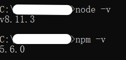 


## 3. 注册Github账号

这里用到Github，是因为我们需要通过Github得到自己的博客网站域名，而且需要使用gitHub同步我们个人博客的相关文件

注册地址：[https://github.com](https://github.com/)
注册流程：https://blog.csdn.net/p10010/article/details/51336332

> 注意：注册Github的时候一定要选择一个合适的名字，因为后来博客网站的域名也会用到这个名字。虽然Github用户名支持后期修改，但是还是会带来很多不必要的麻烦


## 4. 安装Git版本工具

> 使用Git可以帮助我们把本地的网页和文章等内容提交到Gihub上，实现同步

- 下载地址：https://git-scm.com/downloads

  Windows系统需下载，Mac系统因为自带Git无需操作

  详细安装文档：https://blog.csdn.net/u013295518/article/details/78746007

  测试安装：`git --version`，查看显示版本号即成功。如下图：

  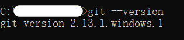 

- 配置SSH：https://blog.csdn.net/qq_35246620/article/details/69061355

  SSH key添加之后，就可以在本机git bash中进行测试，输入`ssh -T git@github.com`进行测试

  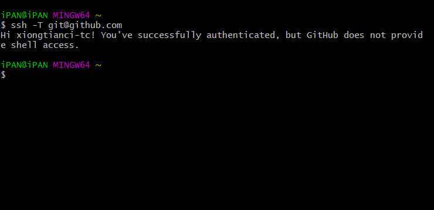 

  显示 `Hi username ！You've successfully...` 说明ssh配置成功了


## 5. 在本地安装 Hexo

> Hexo是一个建站工具，可以帮助我们快速生成基本的博客文件

```
npm install -g hexo-cli
```

>注意：在回车之后，可能会出现一行WARN的警告语句，不用管它，这个不妨碍安装
>
>过一段时间如果出现hexo版本号之类的语句就代表差不多了

然后输入

```
npm install hexo --save
```

这个时候你会看到命令行出现了一堆白字，紧接着输入`hexo v`查看是否安装成功：

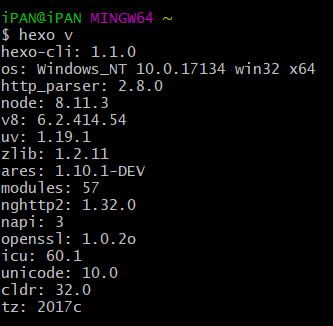 

此时，Hexo已经安装完成


# 二、搭建博客

## 1. 开启GitHub Pages服务

搭建我们的个人博客需要一个唯一的域名，当然我们可以申请购买一个域名来使用，但是在不是太必要的情况下，我们也可以通过Github Pages获得一个免费使用的域名，这需要我们在Github上新建一个仓库，如下：

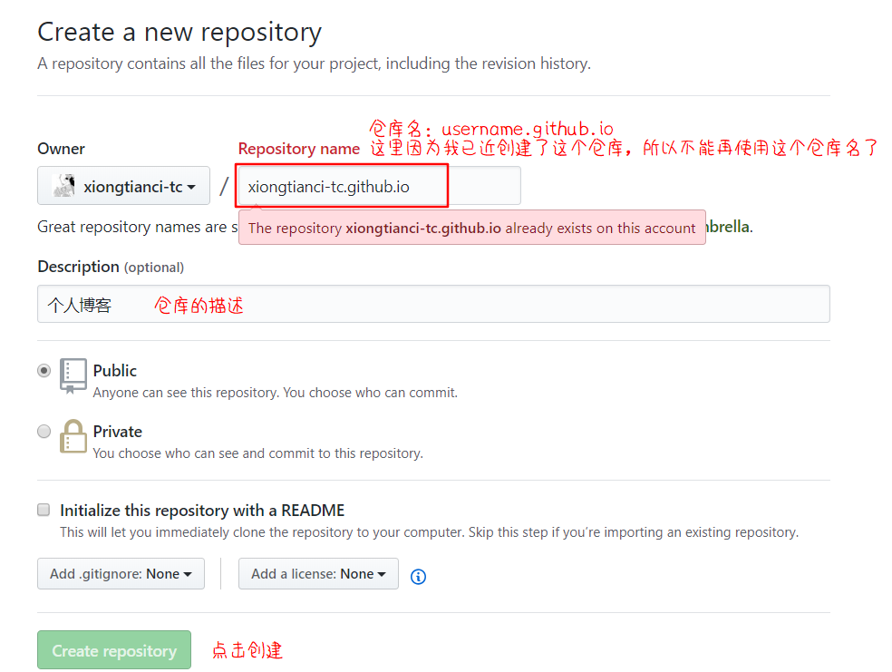

这个过程和建立普通的仓库没什么区别，关键在于新仓库的名字，一定要是：

> 仓库名固定：你的github的username.github.io

 这也是之前强调的要起一个好的用户名的原因。这样之后我们最后的博客网站的链接就会是：`https://UserName.github.io`的形式。

点击`Create Repository`后，选着仓库的`Setting`进入设置

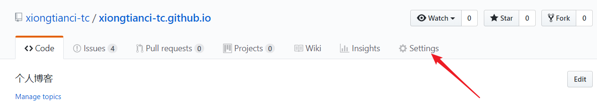


往下滑找到 `Github Pages` 如下：

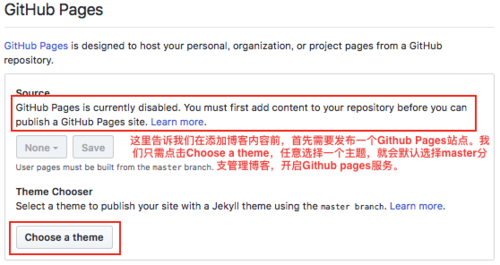

这里我们需要点击 `Choose a theme` 任意选择一个选择主题，然后界面会跳转到仓库，我们看到有两个文件如下：

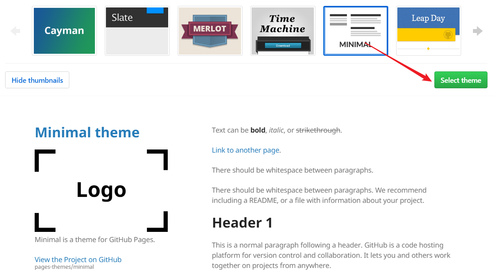

点击 `Select theme` 选着主题后，此时若再查看setting，我们会看到开启GitHub Pages之后得到的域名如下：

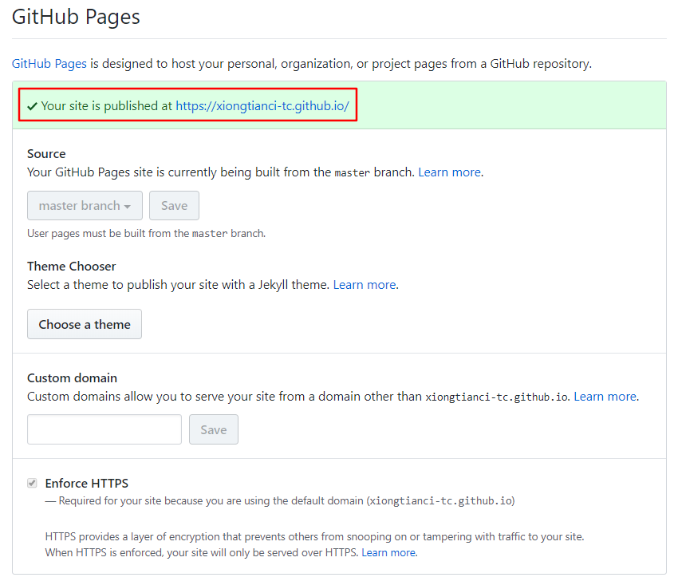

输入你的 GitHub 的用户名和密码，成功后复制`https://username.github.io/`到浏览器打开就行。看！这就是你的博客了，只要能连接到互联网，就能随时查看它(๑•̀ㅂ•́)و✧！


## 2. 创建本地博客站点

上述的步骤相当于我们使用Github page，创建了一个默认的博客页，并且得到了一个可外部访问的域名。但是这个博客页很Low。我们的目的是创建自己个性化的博客网站，所以我们使用Hexo在本地先创建一个本地博客站点，优化后再把它部署到github上。接下来我们使用控制台命令在本地一个合适的位置创建博客站点文件夹如下：

> hexo init  myHexoBlog       //myHexoBlog是项目名

等一会，如果出现橙色的 **WARN** 没关系，只要不出现红色的 **ERROR** 就行。好了后，输入命令：

>  hexo g  	//g是generetor的缩写，生成博客
>
>  hexo s 	//s是server的缩写，启动服务
>

然后点开 <http://localhost:4000/> ，恭喜你！已经在本地搭建好博客了(๑•̀ㅂ•́)و✧！


## 3. 同步Github,允许公共访问

在本地我们已经搭建了博客，但是还只能自己本地访问。若要别人也能看到，那就需要我们将其同步部署到GitHub上了。还记得我们之前准备的Github仓库吗，这里就要用到了。
首先找到我们的博客仓库，并拷贝仓库地址：

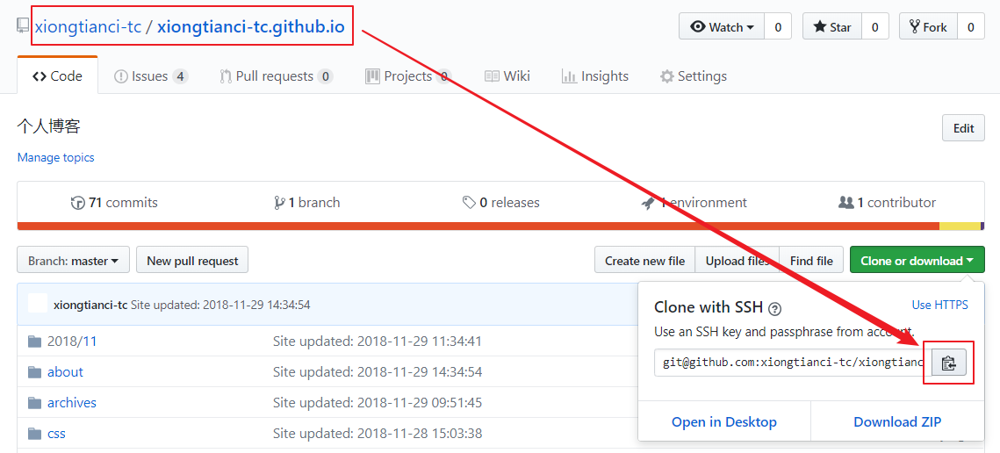

然后修改本地博客目录的配置：
修改本地博客根目录下的`_config.yml`文件，修改`deploy`下的配置，如下：

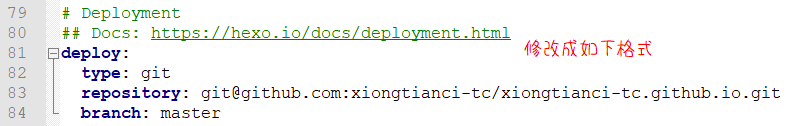

```
deploy:
  type: git
  repository: git@github.com:xiongtianci-tc/xiongtianci-tc.github.io.git #复制的仓库地址
  branch: master
```

> 注意：
>
> 1. repository后面的内容是 git@gitbub.com:username/库地址 的形式
> 2. type、repository、branch冒号的后面都有一个空格（切记~~）

最后执行控制台命令：

```
npm install hexo-deployer-git --save //安装部署插件

hexo d //部署到github
```

现在，我们再次访问链接：`https://userName.github.io`，就会发现这里的界面和本地的一样了。如此一来我们搭建的个人博客网站就基本完成了。


# 三、发布你的第一篇博客

终于可以发布自己的第一篇博客了，是不是很激动？（博主当时可是超级激动的~）
首先，在本地博客文件夹根目录输入：

```
hexo new "我个人博客的第一篇博客，激动~"
hexo g   //生成网页
hexo d  //部署到远端(github)
```

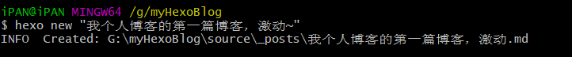 

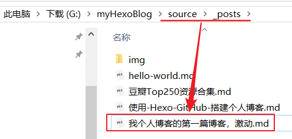 

现在打开我们的博客网站：`http://UserName.github.io`,会看到网页如下(可能需要刷新几次页面)：

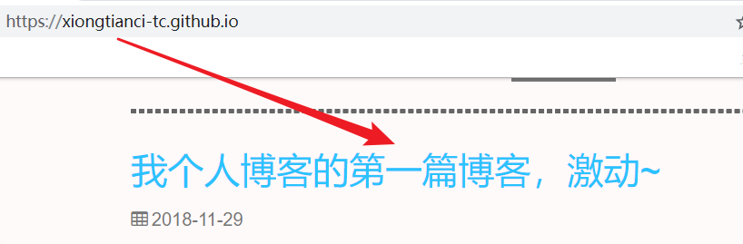

需要编写博客内容时，只需编写本地博客的 `_posts` 的博客原文，然后通过 `hexo g && hexo d` 重新部署到github即可


# 四、更换主题

此时，我们的个人博客已经搭建完成。但是我们需要网站更加高大上，更加美观些，我们可以通过更换主题来实现个性化博客

这里以使用github上的next主题为例：

## 1. 下载主题

next主题：https://github.com/iissnan/hexo-theme-next

在控制台中切换到本地博客根目录输入：

```
$ git clone --branch v5.1.2 https://github.com/iissnan/hexo-theme-next themes/next
```

下载成之后我们会看到next的主题已经存在 `thems` 里了如下：

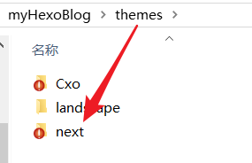 


## 2. 更换主题

修改博客根目录(不是next主题)下的 `_config.yml` 文件，搜索 `theme` 字段，并将其值修改为 `next`

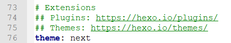 

然后在控制台下输入如下命令：

```
hexo clean  //清理缓存
hexo g    //重新生成博客代码
hexo d   //部署到本地
// 或者直接输入：hexo clean && hexo g && hexo d
```

再次打开我们的博客网站：`https://UserName.github.io`，将会发现我们的博客主题已经发生了改变


# 五、个性化

通过此步骤我们可以设置博客的作者、格言、语言...

> 在Hexo中有两份主要的配置文件，其名称都是 _config.yml。 其中，一份位于站点根目录下，主要包含 Hexo本身的配置；另一份位于主题目录下，这份配置由主题作者提供，主要用于配置主题相关的选项

## 1. 站点配置

在本地的博客根目录下找到_config.yml，用编辑器打开进行内容的设置，如下：

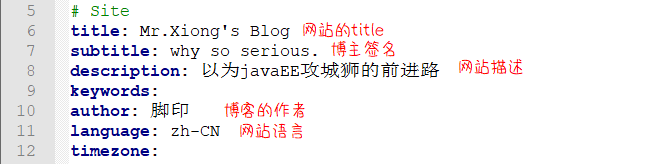

这里可以修改博客网站的标题、描述，语言等属性


## 2. 主题设置

网上有个超级详细的教程，我就不赘述了：

文档地址：http://theme-next.iissnan.com/getting-started.html


------

终于结束了，

最后，